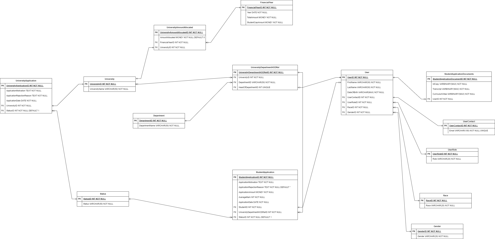

<h1>Bursary System</h1>

<h2>ERD</h2>

<h2>Set UP</h2>

RUN SCRIPTS IN ORDER:

<ol>
    <li>Database -> CreateDatabase</li>
    <li>Table -> FinancialYear</li>
    <li>Table -> University</li>
    <li>Table -> UniversityAmountAllocated</li>
    <li>Table -> Status</li>
    <li>Table -> UniversityApplication</li>
    <li>Table -> UserContact</li>
    <li>Table -> UserRole</li>
    <li>Table -> Race</li>
    <li>Table -> Gender</li>
    <li>Table -> User</li>
    <li>Table -> StudentApplicationDocuments</li>
    <li>Table -> Department</li>
    <li>Table -> UniversityDepartmentHODRel</li>
    <li>Table -> StudentApplication</li>
    <li>Function -> udfTotalAmountAllocatedForFinancialYear</li>
    <li>Function -> udfIsUniversityApproved</li>
    <li>Function -> udfStudentApplicationCapAmountForYear</li>
    <li>Function -> udfCalculateAge</li>
    <li>Function -> udfRetrieveUniversityByApplicationStatus</li>
    <li>Function -> udfRetrieveStudentByApplicationStatus</li>
    <li>Procedure -> uspCreateUser</li>
    <li>Procedure -> uspCreateUniversity</li>
</ol>